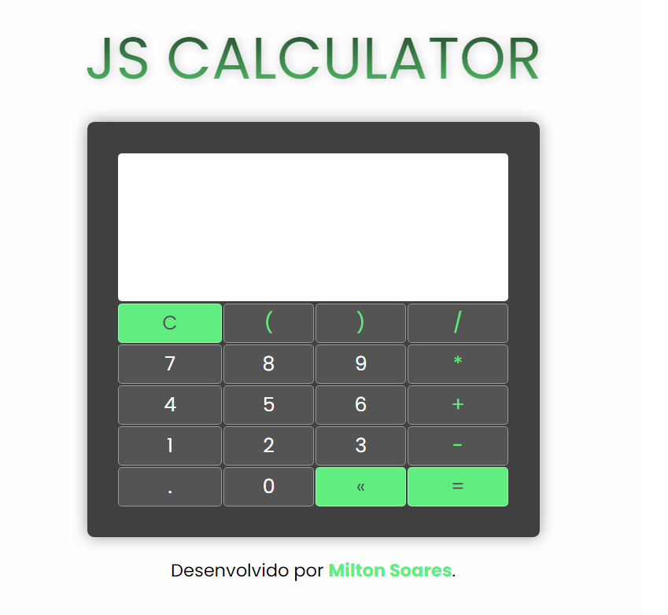

  <h1>JS Calculator</h1>

  <h2>How to contact me:</h2>

# Objetivo:

Esse projeto foi desenvolvido como exercício para pratica de lógica de programação e programação orientada a objetos com JavaScript.

## Principais Aprendizados:
Através deste projeto pude fixar melhor os conceitos de programação orientada a objetos, explorando a integração do JS com elementos DOM através do `addEventListener()`.

Além disso, vi como utilizar a função `eval()` que é nativa do JS.
Aprendi que essa função consegue computar um código JavaScript representado como uma String.

A lógica por trás da construção da calculadora foi utilizar um elemento HTML input do tipo texto como display, fazendo com que ele recebesse os valores dos botões em formato string e, assim, utilizar a função eval para transformar as strings em um cáculo aritmético nativo do JS.

Além disso, a aplicação possui validação de erros, através de alertas à contas com STRINGS, vazias e divisões por 0.

# Resultado do projeto:

Layout simples e minimalista.
Carrego o gosto por cores escuras e contraste voltado para verde.
A intenção foi estilizar deixando os principais botões de ação com cores chamativas (Clear, Delete e Equal btns). Dar um toque de estilo nos botoões com os símbolos aritméticos, mudando somente a cor do texto para o verde.

Além disso, no título utilizei o `-webkit-background-clip` e `webkit-text-fill-color` para dar o efeito de gradiente no texto.

# Contribua com o projeto:

1. Faça um fork do projeto;

2. Crie uma branch para fazer suas modificações (`git checkout -b my-new-resource`);

3. Faça o commit (`git commit -am 'Adding a new resource...'`)

4. Faça o push (`git push origin my-new-resource`)

5. Envie um Pull Request

# Licença
Esse projeto está sob a licença MIT. Veja o arquivo [LICENSE](LICENSCE.MD) para mais informções.

Projeto desenvolvido por <a href="https://www.linkedin.com/in/soaresmilton/"><strong>Milton Soares</strong> 
 </a>

